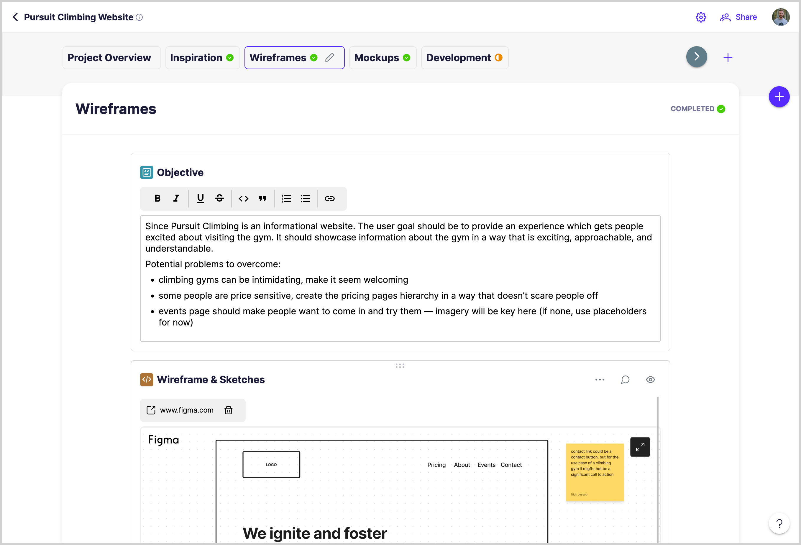
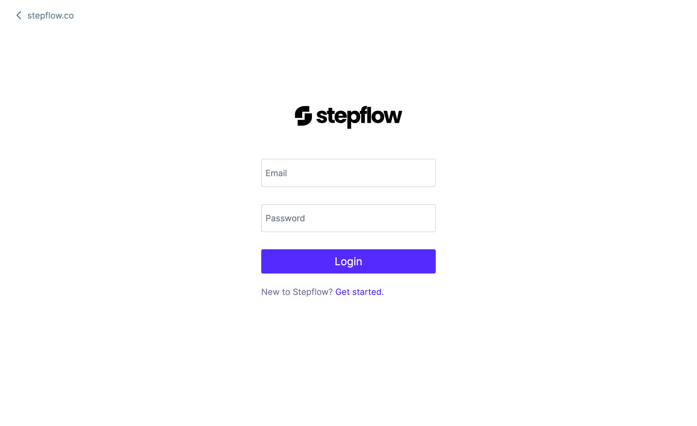
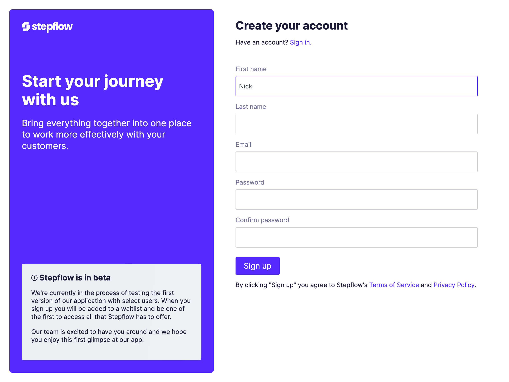
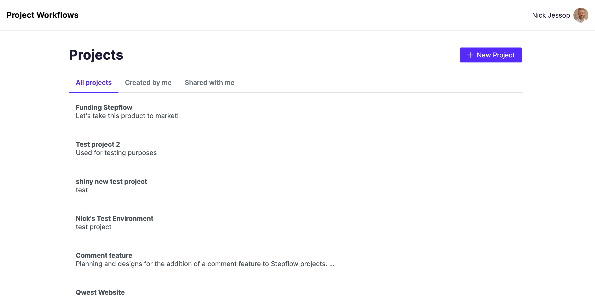
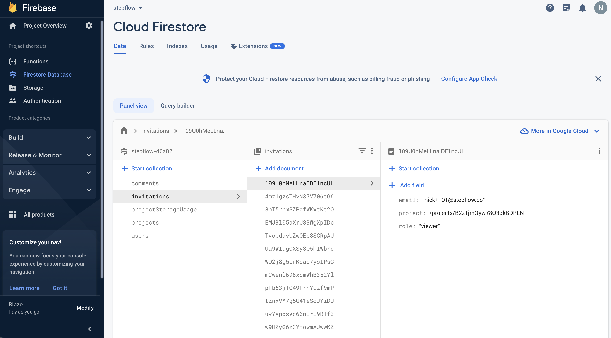
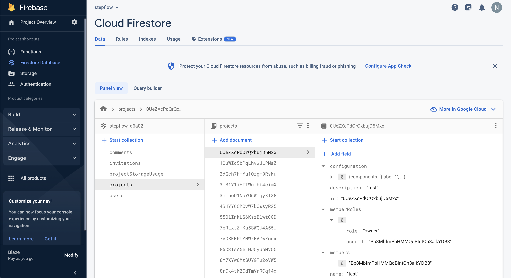
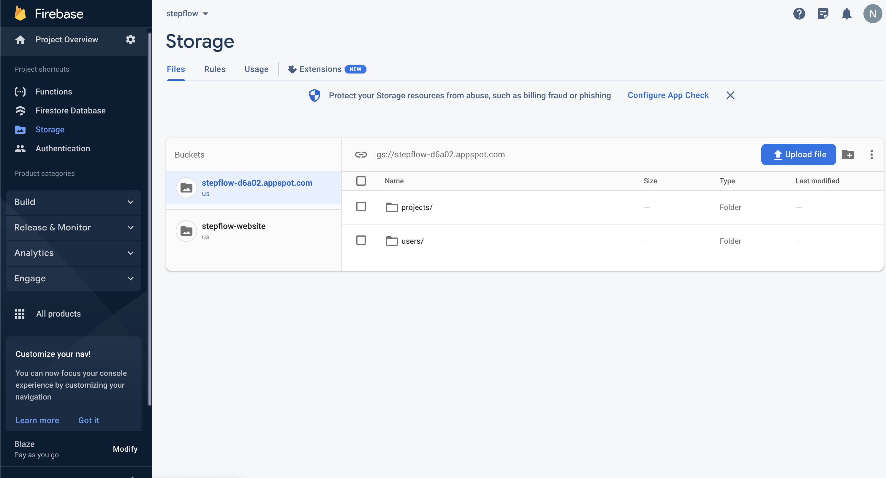

# Project Workflows App

> [!WARNING]
> This repo is not actively maintained. Use as is.

Project Workflows provides the easiest way to work with collaborators outside your organization. It's everything you need in workflow, instead of getting lost in email, Slack, or tracking down links across multiple applications.

When working with collaborators outside your organization often times projects become disorganized, key information gets missed, and productivity decreases.

The product is an external collaboration tool that brings everyone together in a simple workflow. Create the steps of your workflow and then add blocks to store your content. Blocks offer an easy way to add the content you need, in the format that works best. Image gallery, table, PDF, and embed blocks are just a few of the options available!

What you end up with is a workflow that combines all the information you need to get a project done, in one place. This becomes a common reference point everyone can look to.



## Setup

The folder structure of this app is organized using nx CLI, and is set up as follows:

```
 |-- apps
    |-- project-workflows (Main Frontend app)
 |-- functions (Firebase functions)
 |-- libs (Shared library between apps projects)
```

Install npm version 6.14.16 and node 12.22.10. It is recommended to use nvm with ohmyzsh, and to add a script that allows your terminals to automatically change your node/npm versions based on .nvmrc file contexts.

See https://github.com/nvm-sh/nvm#calling-nvm-use-automatically-in-a-directory-with-a-nvmrc-file
and
https://github.com/ohmyzsh/ohmyzsh

# Firebase and Send Grid Set Up

Replace placeholders in apps/project-workflows/src/app/services/firebase/firebase.service.ts with your Firebase settings

Replace placeholders in /functions/src/index.ts with your SendGrid settings

## Development server

1. Install packages and dependencies,
   Run `npm i`

2. For quick start of Project Workflows use:
   `npm run project-workflows`

Here are a few other useful commands:

For Angular CLI
Run `ng serve` for a dev server. Navigate to `http://localhost:4200/`. The app will automatically reload if you change any of the source files.

For NX CLI
Run `nx serve` for a dev server. Navigate to `http://localhost:4200/`. The app will automatically reload if you change any of the source files.

For running NX CLI without it install globally

Run `npm run project-workflows` for a dev server. Navigate to `http://localhost:4200/`. The app will automatically reload if you change any of the source files.
OR
Run `npm run project-workflows-api` for a API dev server, this currently isn't used much as we aren't fully migrated from Firebase functions. API route at `http://localhost:3333/api/`.
OR
Run `npm run nx serve` for a dev server. Navigate to `http://localhost:4200/`. The app will automatically reload if you change any of the source files.

## Code scaffolding

### Creating components

Run `npm run nx g @nrwl/angular:component component-name` to generate a new component. You can also use `ng generate directive|pipe|service|class|guard|interface|enum|module`.

### Creating services

Run `npm run nx -- g @nrwl/nest:service --project=api` to generate a new service for API. You can also use `ng generate directive|pipe|service|class|guard|interface|enum|module`.

## Build

Run `ng build` to build the project. The build artifacts will be stored in the `dist/` directory. Use the `--prod` flag for a production build.

## Running end-to-end tests

Run `ng e2e` to execute the end-to-end tests via [Protractor](http://www.protractortest.org/).

## Deployment to Firebase from Local machine

To build the full Project Workflows app, with the new authenication page do the following:

1. Using terminal from the root of the project, use `npm run build-project-workflows-prod`
2. Once built, use `firebase deploy --only hosting:project-workflows-app` to deploy the locally compiled Project Workflows app to firebase

## Screenshots







## Firebase Example Configuration








